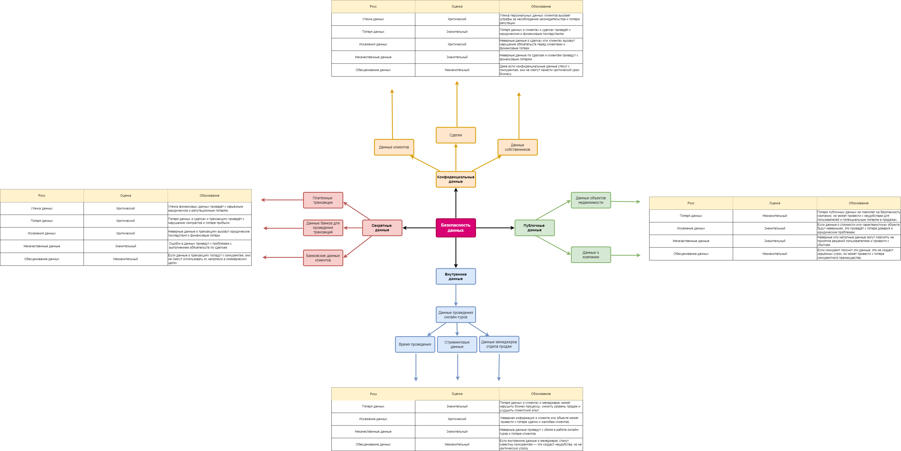

### Задание 1. Разработка проверочного листа по безопасности данных:

Первым делом нужно разработать проверочный лист по безопасности данных.
Сейчас это ключевая проблема компании и самое уязвимое место.
Чтобы создать документ, выполните четыре шага.

1. Проанализируйте диаграмму и описание системы PropDevelopment
   Классифицируйте типы данных, с которыми работает компания, по стандартам ISO/IEC 27001 и 27002.
   Распределите их по четырём категориям:
    * публичные данные,
    * внутренние данные,
    * конфиденциальные данные,
    * секретные данные.
2. Определите риски для каждой категории данных
    * утечка данных,
    * потеря данных,
    * искажение данных,
    * некачественные данные,
    * обесценивание данных.
3. Объясните, почему именно этот риск актуален для указанной категории данных
4. Дайте оценку каждому риску
   В качестве шкалы используйте категории «незначительный-значительный-критический».
5. Визуализируйте результаты анализа в виде mindmap
   Для создания mindmap используйте draw.io. В центре разместите блок «Безопасность данных».
   От него протяните стрелочки и разместите следующий уровень — выделенные категории данных.
   На следующем уровне укажите, какие именно данные компании относятся к этой категории.
   Для каждого типа данных укажите риск и присвойте ему оценку. На последнем уровне объясните, почему вы оценили риск именно так.

В директории Task1 должен лежать mindmap, созданный в draw.io.
Он должен отражать типы данных, которые использует компания, классы этих данных и соответствующие им риски.

### Решение:
| Категории данных        | Риски                                                                                        | Данные                                                                                                                                               |
|-------------------------|----------------------------------------------------------------------------------------------|------------------------------------------------------------------------------------------------------------------------------------------------------|
| Публичные данные        | потеря данных, искажение данных, некачественные данные, обесценивание данных                 | `Данные о недвижимости`: стоимость, характеристики, расположение, фото;  `Данные о компании`: юр. адресс, расположение                               |
| Внутренние данные       | потеря данных, искажение данных, некачественные данные, обесценивание данных                 | `Данные проведения онлайн-туров`: ссылка на недвижимость, ссылка на покупателя, ссылка на менеджера, стриминговые данные                             |
| Конфиденциальные данные | утечка данных, потеря данных, искажение данных, некачественные данные, обесценивание данных  | `Данные о клиентах`: ФИО/email/паспорт, данные о сделках; `Данные о собственниках`:  ФИО/email/паспорт, платежи по ЖКХ, данные о личной недвижимости |
| Секретные данные        | утечка данных, потеря данных, искажение данных, некачественные данные, обесценивание данных  | `Данные о сделках`: платежные транзакции, финальная стоимость объекта; `Данные банков и клиентов`: платежная информация                              |

### Mindmap:

