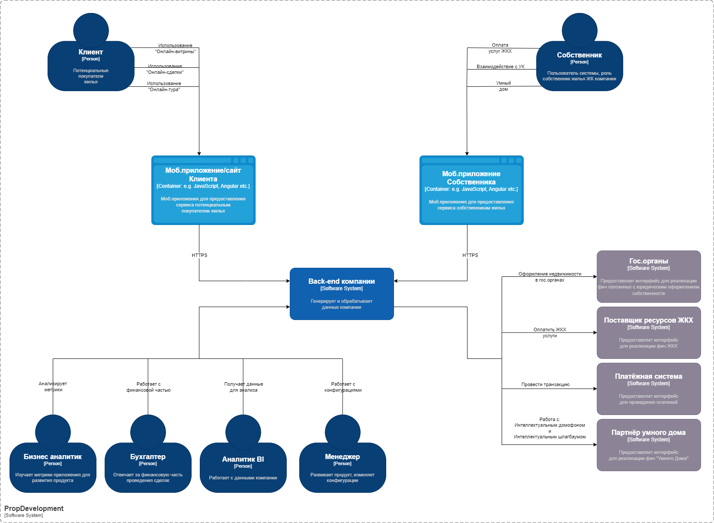
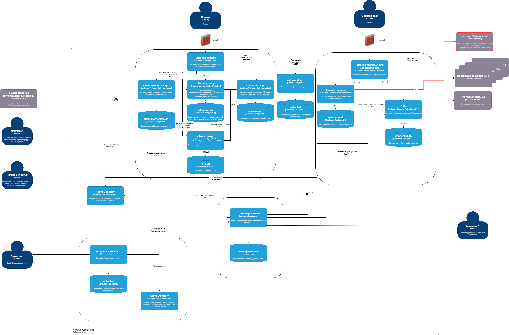

### Задание 3. Внешние интеграции

PropDevelopment хочет расширить бизнес-функции для собственников и жильцов.
Компания планирует добавить в систему новые сервисы «Умный дом». Эти сервисы готов предоставить партнёр.

# Вы согласовали техническое задание с бизнесом и выбрали две услуги для внедрения:
- Интеллектуальный домофон. Включает функции классического видео-домофона — открытие по звонку. Также есть возможность распознавать пользователей по биометрии (по лицу) и автоматически открывать дверь, если им разрешён доступ в дом.
- Интеллектуальный шлагбаум. Включает функции классического управления шлагбаумом и автоматически открывает доступ, если распознаёт номера автомобилей, которым въезд разрешён.

Новые сервисы должны быть доступны через текущее мобильное приложение, которое используют собственники.
Что нужно сделать:

1. Подготовьте диаграмму контекста в модели С4. Она должна отражать контекст, в котором будут работать новые бизнес-функции.
2. Доработайте диаграмму контейнеров PropDevelopment. Отразите на ней изменения, которые вы предлагаете сделать в ландшафте систем кампании в связи с внедрением новых бизнес-функций.
3. Сформируйте список требований, которым должны удовлетворить внешние интеграции. Для этого:
   - опишите требования к безопасности,
   - выделите протоколы аутентификации и авторизации,
   - опишите, как будет организовано взаимодействие между системами предприятия и внешней платформой.

Когда выполните задание, загрузите в директорию Task3 диаграмму контекста, обновлённую диаграмму контейнеров и список требований.

### С4 Context Diagram

### С4 Containers Diagram

### Список требований для интеграции «Умного дома» в PropDevelopment:

## 1. Требования к безопасности
Интеграция с сервисами партнёра должна обеспечивать защиту персональных данных, отказоустойчивость и контроль доступа.

### **Защита персональных данных**
- **Шифрование данных**:
   - Все передаваемые данные (видео, биометрия, номера авто) должны быть зашифрованы с использованием современных протоколов.
   - Чувстительные данные, такие как: пароли, банковские карты и т.д., хранящиеся в БД, должны быть зашифрованы.
- **Минимизация передаваемых данных**:
   - Передавать только необходимую информацию в зашифрованном виде.
   - Исключить передачу избыточных или чувствительных данных без явного запроса.
- **Обезличивание и анонимизация**:
   - Хранение биометрических данных должно проходить через хэширование и токенизацию.
   - В отчётах и логах не хранить открытые персональные данные.

### **Защита от несанкционированного доступа**
- **Контроль доступа**:
   - Доступ к устройствам только через авторизованных пользователей.
   - Операции по управлению "умным домом" должны логироваться и после чего проходить аудит.
- **Защита от атак**:
   - Реализовать защиту от Brute Force и DoS-атак.
   - Ограничить количество запросов к API через Rate Limiting.
- **Логирование и аудит**:
   - Все запросы к системам должны логироваться.
   - Логи должны храниться минимум 90 дней и быть защищены от изменений.

---

## 2. Протоколы аутентификации и авторизации
### **Аутентификация**
- **OAuth 2.0 / OpenID Connect (OIDC)**:
   - Использовать OAuth 2.0 для взаимодействия мобильного приложения с платформой.
   - Для взаимодействия между серверами использовать JWT (JSON Web Token).
- **Многофакторная аутентификация (MFA)**:
   - Требовать MFA (например, SMS-код или Push-уведомление) для добавления новых устройств.

### **Авторизация**
- **Ролевая модель (RBAC)**:
   - Разделение прав для собственников, администраторов, гостей.

---

## 3. Организация взаимодействия между системами
Интеграция должна бесшовно работать с существующей IT-инфраструктурой PropDevelopment.

### **Общий принцип работы**
1. **Запрос доступа через мобильное приложение**
   - Пользователь отправляет запрос на вход через приложение PropDevelopment.
2. **Проверка прав доступа**
   - Система PropDevelopment проверяет наличие разрешения в БД.
3. **Передача команды в партнёрскую систему**
   - После подтверждения, отправляется API-запрос в систему партнёра Smart Home.
4. **Открытие двери/шлагбаума**
   - Устройство получает команду и открывает доступ.
5. **Фиксация события в логах**
   - Логи сохраняются в нашей системе.

### **API-взаимодействие**
- **REST API**:
   - Использовать REST API для передачи данных между PropDevelopment и партнёрской платформой.
   - Все запросы должны быть зашифрованы и аутентифицированы.